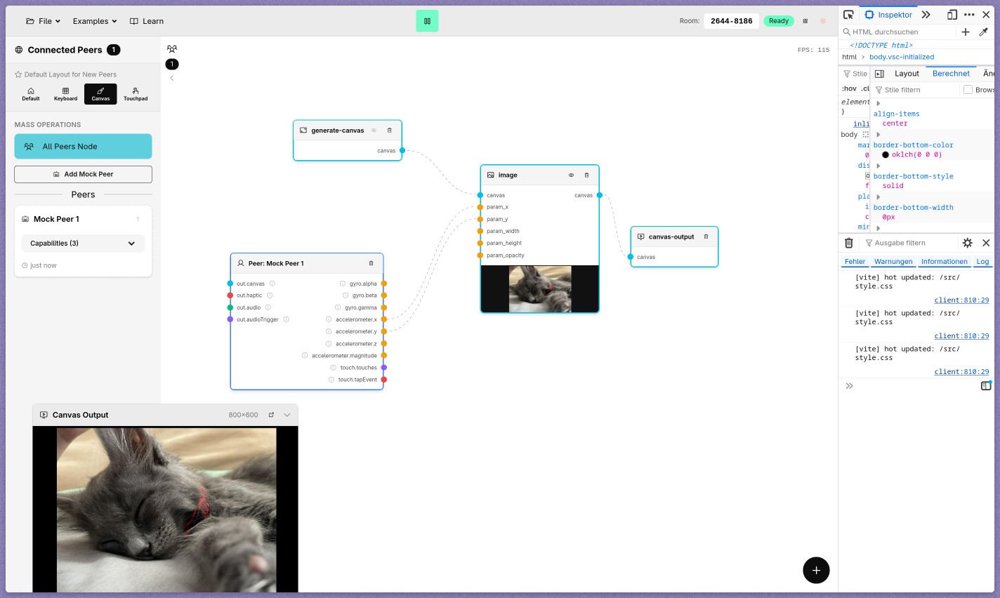

# Leitmotif




Leitmotif is a node-based creative tool for collaborative/participative audiovisual art.
It's kind of like [Touchdesigner](https://derivative.ca/) or [cables](https://cables.gl/), but web-based and designed for real-time collaboration and performance. 
It allows artists, designers, educators, and developers to create interactive audiovisual experiences that let you use your audience as a creative material.

Check it out live: [https://lea-ger.github.io/leitmotif/](https://lea-ger.github.io/leitmotif/).

The project is built with Vue.js and Bun, leveraging WebRTC for peer-to-peer communication.

## Project Context

This project was created as a project for my master thesis at the [Technische Hochschule Köln](https://www.th-koeln.de/). 
With the premise of a tool for creating interactive real-time audiovisual experiences, the goal was to explore how to design and implement such a tool in a way that is accessible to a wide range of users.
This was inspired by my own experience using tools like Touchdesigner or Hydra, which even I as a techie found to have a steep learning curve.

## Installation

### Requirements

- Bun: `>=1.0.0` (recommended)
- Node.js: `>=18.0.0`
- Modern browser with WebRTC support

### Setup with Bun

```bash
git clone git@github.com:lea-ger/leitmotif.git
cd leitmotif
bun install
```

### Run locally

```bash
bun run dev
```

### Build for production

```bash
bun run build
```

### Preview the production build

```bash
bun run preview
```

## Usage

For learning how to use Leitmotif, the best way is to check out the [in-app documentation](https://lea-ger.github.io/leitmotif/learn/)!

## Repository Structure

Here's a guide where to find what:
- `src/main.ts` and `src/App.vue`: App entry and shell
- `src/views/`: Main screens such as editor, client, and learning views
- `src/components/`: Reusable UI components such as node cards, panels, and modals
- `src/components/client/`: Peer-side mobile layouts (canvas, keyboard, touchpad, empty)
- `src/nodes/`: Node system definitions and implementations
- `src/engine/`: Graph execution logic
- `src/stores/`: Pinia stores for graph, peers, variables, session, and canvas state
- `src/data/demoWorkflows.ts`: Demo workflow presets
- `src/docs/`: In-app documentation content and types
- `src/utils/`: Shared helper utilities
- `public/`: Static assets served as-is
- `docs/`: Extra project documentation

[In the `docs/` folder](/docs), you can find the Architecture Decision Records (ADRs) that document the key architectural choices made during development.

## License

This project is licensed under the MIT License. See [LICENSE](LICENSE.md) for details.

## Contact me

- Email: [leander.gerwing@gmail.com](mailto:leander.gerwing@gmail.com)
- Email (university): [leander_robert_bernhard.gerwing@smail.th-koeln.de](mailto:leander_robert_bernhard.gerwing@smail.th-koeln.de)
- My website: [https://le-ger.com](https://le-ger.com)

## Contributing (Optional)

If you like to contribute, just to a PR and we'll figure out the rest :)
